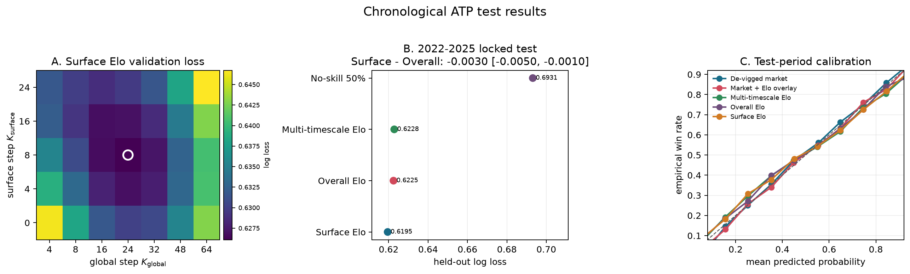
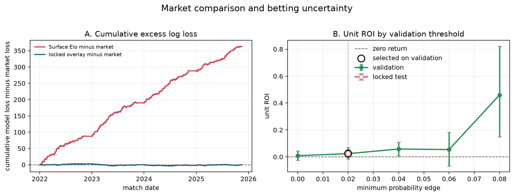

# Elo as Constant-Step SGD: Dynamic Skill and ATP Forecasting

The Elo rating system is an online estimation method for latent player skill.
After each match, it updates the two players' ratings and uses their rating
difference to predict future match outcomes. The main tuning problem is the
update size: a small update gives less variable ratings but responds slowly
when skill changes, whereas a large update adapts faster but introduces more
estimation noise. The project studies that trade-off in controlled simulations
and chronological ATP forecasts. It then compares Elo forecasts with
betting-market probabilities.

If $Y_t\in\lbrace 0,1\rbrace$ is the match outcome and $p_t$ is the pre-match win
probability, Elo updates the logistic skill coordinate $\theta_t$ by

$$
\theta_{t+1}=\theta_t+\alpha(Y_t-p_t),
\qquad
\alpha=\frac{\log 10}{400}K.
$$

This is stochastic gradient descent (SGD) for logistic loss. Here $K$ is the
usual Elo update factor and $\alpha$ is the corresponding constant SGD learning
rate. The project asks three separate questions: how $\alpha$ controls
stationary rating error when skill is fixed; how it controls tracking error when
skill changes; and how Elo variants perform in held-out ATP forecasting and
market comparisons.

The stationary part is directly connected to my paper with Cheng Mao and
Debankur Mukherjee,
[Scaling Limits of Constant-Stepsize SGD at Flat Minima](https://arxiv.org/abs/2607.16384)
(submitted to *Mathematics of Operations Research*). The paper separates local
flatness from tail growth. In the Elo experiment, the expected logistic loss
has positive curvature at its minimizer, so $m=2$, but grows only linearly in
the tails, so $\beta=1$. It is locally strongly convex but not globally strongly
convex. The local $\sqrt{\alpha}$ fluctuation scale is the quadratic case of the
paper, while the linear tails fall under its subquadratic-tail framework. This
experiment does not test the $m>2$ non-Gaussian scaling results. The
dynamic-skill simulation is a separate tracking problem based on Aldous's Elo
analysis, and the ATP and market sections are chronological empirical studies.

## Main Results

1. **Stationary simulation.** The expected logistic loss has
   $(m,\beta)=(2,1)$. Linearization at the minimizer gives the limiting benchmark
   $\mathrm{Var}(\widehat\theta-\theta^\star)/\alpha\to 1/2$. Simulated ratios
   range from $0.484$ to $0.516$ over
   $K\in\lbrace 2,4,8,16,32\rbrace$.
2. **Dynamic simulation.** Ten independent replications per process and time
   scale give a smooth-skill exponent of $-0.61$ (95% Monte Carlo interval
   $[-0.61,-0.60]$; reference $-2/3$) and an OU exponent of $-0.41$
   ($[-0.42,-0.40]$; reference $-1/2$). The intervals measure simulation error
   for this finite-horizon design. These exponents concern tracking a changing
   parameter and are separate from the stationary scaling in my paper.
3. **ATP model comparison.** The study contains 39,247 completed matches from
   2010–2025. The 2018–2021 validation period selects Surface Elo with
   $K_{\mathrm{global}}=24$ and
   $K_{\mathrm{surface}}=8$. On 10,287 held-out 2022–2025 matches, its log loss
   is $0.619510$ versus $0.622469$ for Overall Elo. The paired difference is
   $-0.002959$, a 0.48% relative reduction; the 95% monthly
   block-bootstrap interval is $[-0.004960,-0.001022]$ across 46 month blocks.
4. **Market comparison.** On market-covered test matches, de-vigged odds have
   log loss $0.584254$, compared with $0.619541$ for Surface Elo. A
   validation-fitted market/Elo overlay scores $0.584248$, but its difference
   from the market has interval $[-0.001180,0.001089]$, which includes zero.
5. **Historical betting test.** The 2% threshold selected on validation produces
   4,480 bets in the test period and 2.52% unit ROI, with a monthly
   block-bootstrap interval of [-0.18%, 5.26%]. The interval crosses zero,
   prices are not timestamped, and execution is not modeled. The result does
   not establish a trading strategy.

## Elo and SGD

For Elo ratings $R_i$ and $R_j$, the Bradley–Terry win probability is

$$
p_{ij} = \frac{1}{1+10^{-(R_i-R_j)/400}}.
$$

After observing $Y_t\in\lbrace 0,1\rbrace$, the conventional Elo update is

$$
R_{i,t+1}=R_{i,t}+K(Y_t-p_{ij,t}), \qquad
R_{j,t+1}=R_{j,t}-K(Y_t-p_{ij,t}).
$$

Define the natural logistic coordinate

$$
\theta_i=\frac{\log 10}{400}R_i.
$$

Then the same recursion is constant-step SGD for binary logistic loss,

$$
\theta_{i,t+1}=\theta_{i,t}+\alpha(Y_t-p_{ij,t}),
\qquad
\alpha=\frac{\log 10}{400}K=\frac{K}{173.72}.
$$

Only rating differences are identifiable: adding the same constant to every
rating leaves all match probabilities unchanged. The SGD interpretation is
therefore made on the centered rating subspace, equivalently after fixing one
additive rating level. The zero-sum Elo update preserves this normalization.

$K$ is kept in the rating code because it is the standard Elo convention;
$\alpha$ is used in the SGD analysis. The conversion is implemented and tested
in `elo_online/model.py`.

## Controlled Experiments

The first experiment fixes the true skill of one player and repeatedly matches
that player against known opponents. Every step size sees the same opponents
and outcomes. Post-burn-in errors estimate the stationary distribution. In the
correctly specified scalar model, the Hessian and gradient-noise variance are
both $A=\mathbb{E}[p^\star(1-p^\star)]$, so the limiting Lyapunov equation is
$2A\Sigma=A$ and $\Sigma=1/2$. A derivation is given in
[the experiment notes](docs/experiment_notes.md).

The positive Hessian gives the local exponent $m=2$. The loss grows linearly
as the skill estimate tends to either tail, giving $\beta=1$. The variance plot
checks the local $m=2$ stationary scale; the linear tails identify the global
geometry covered by the paper's subquadratic-tail assumptions.


The second experiment replaces the fixed skill by three latent processes:

- smooth sinusoidal movement;
- mean-reverting Ornstein–Uhlenbeck movement; and
- infrequent skill jumps.

For each time scale $\tau$, the code evaluates a grid of constant steps in 10
independent replications. Candidate steps share common random numbers within a
replication. The selected step minimizes mean tracking MSE across replications.
Replication bootstrap intervals quantify Monte Carlo uncertainty in the fitted
slopes. They do not cover finite-horizon or model-specification error.


The stationary experiment estimates the invariant variance for fixed skill.
The dynamic experiment estimates the step that minimizes tracking MSE for
time-varying skill. Aldous's smooth and OU reference exponents are $-2/3$ and
$-1/2$. No reference exponent is specified for the jump process.

## ATP Walk-Forward Study

The ATP study compares three rating models:

1. **Overall Elo:** one rating per player and a constant $K$.
2. **Surface Elo:** a global rating plus a player-specific surface offset, with
   separate global and surface update factors.
3. **Multi-timescale Elo:** an online log-loss mixture of Elo experts with
   $K\in\lbrace 4,8,16,24,32,48,64\rbrace$.

The chronological design is fixed as follows:

| period | role | completed matches |
|---|---|---:|
| 2010–2017 | state warm-up | 20,232 |
| 2018–2021 | model and strategy selection | 8,728 |
| 2022–2025 | locked test | 10,287 |

Player A and player B are assigned alphabetically, independently of who won, so
the target cannot leak through row orientation. The workbooks contain dates but
not timestamps. All matches on a calendar date are therefore predicted as a
batch before any result from that date updates a rating. This avoids using an
arbitrary row order as if it were known event time.

ATP ranking columns are retained in the cleaned data but are not used as
predictors. The Elo models therefore use only past match outcomes and surface.
Market odds are evaluated separately and contain information not included in
these models.



The market comparison uses Pinnacle decimal odds when available and the
reported bookmaker average otherwise. Implied probabilities are normalized to
remove the two-sided overround. Hyperparameters, overlay coefficients, and the
betting threshold are selected only on 2018–2021.

The Surface-minus-Overall interval and the
[year-by-year stability table](docs/tables/tennis_yearly_stability.csv) are
computed after model selection and are not selection inputs. Surface Elo has
lower log loss in each test year, although the 2025 difference is only
$-0.000173$.



The selected overlay is

$$
\mathrm{logit}(p_{\mathrm{overlay}})
= \mathrm{logit}(p_{\mathrm{market}})
+0.05-0.25\left[
\mathrm{logit}(p_{\mathrm{Elo}})
-\mathrm{logit}(p_{\mathrm{market}})
\right].
$$

Validation selects an Elo weight of $-0.25$. Thus the overlay moves market
log-odds in the direction opposite to the difference between Elo and market
log-odds. On the test period, the overlay-minus-market log-loss interval is
$[-0.001180,0.001089]$, so it includes zero. The ROI interval also includes
zero. Neither calculation models latency, limits, market impact, simultaneous
exposure, or whether the recorded price was available before the match.
Order-sensitive bankroll and drawdown fields remain in lower-level tables for
compatibility, but they are not used as portfolio-risk estimates.

## Repository Layout

```text
elo_online/
  model.py        Elo updates and the exact K/alpha conversion
  simulation.py   stationary and dynamic-skill experiments
  tennis.py       overall, surface, and multi-timescale Elo states
  data.py         ATP workbook download and deterministic cleaning
  evaluation.py   chronological selection, bootstrap, and betting rule
  metrics.py      proper scores and calibration diagnostics
  reporting.py    reproducible aggregate tables and figures

scripts/
  run_simulations.py
  run_real_data.py
  build_all.py

docs/
  figures/
  tables/
  experiment_notes.md
```

## Reproduce

Python 3.10 or newer is required.

```bash
python3 -m venv .venv
source .venv/bin/activate
python -m pip install -e .

python -m unittest discover -s tests -v
python scripts/run_simulations.py
python scripts/run_real_data.py
```

`python scripts/build_all.py` rebuilds every committed figure and aggregate
table. Simulation seeds and bootstrap seeds are fixed. ATP workbooks are cached
under `data/cache/`, which is excluded from version control. No raw or row-level
Tennis-Data records are committed.

## References

- Jingyi Zhang, Cheng Mao, and Debankur Mukherjee,
  [Scaling Limits of Constant-Stepsize SGD at Flat Minima](https://arxiv.org/abs/2607.16384),
  submitted to *Mathematics of Operations Research*, 2026.
- David J. Aldous,
  [Elo Ratings and the Sports Model: a Neglected Topic in Applied Probability?](https://www.stat.berkeley.edu/~aldous/Papers/me-Elo-SS.pdf),
  *Statistical Science* 32 (2017), 616–629.
- Sam Olesker-Taylor and Luca Zanetti,
  [An Analysis of Elo Rating Systems via Markov Chains](https://papers.neurips.cc/paper_files/paper/2024/file/f9db8bd38c36391ddc4ccc0d23effdbe-Paper-Conference.pdf), NeurIPS 2024.
- Tennis-Data,
  [ATP results and betting odds](http://www.tennis-data.co.uk/data.php).

## License

Code is released under the MIT License. The downloaded ATP workbooks are not
part of that license and remain subject to the data provider's terms.
