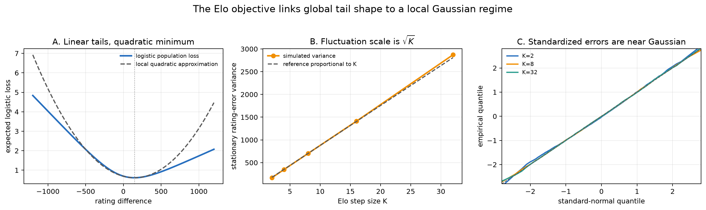
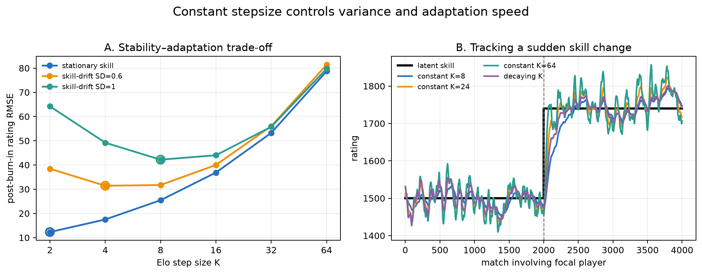
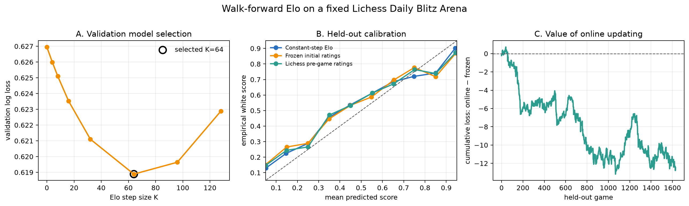

# Online Elo as Constant-Step SGD

This repository is a small study of the Elo update rule as an online
stochastic-gradient method. The code has two parts:

- controlled simulations where the true ratings are known;
- a walk-forward prediction experiment on one fixed public Lichess tournament.

The goal is not to build a production chess-rating system. I use Elo because
it is a clean example of a constant-step online algorithm: the same parameter
that creates stationary noise also lets the ratings adapt after the underlying
skill level changes.

## Model

For players with ratings `r_i` and `r_j`, write `x = r_i - r_j`. The usual
Elo expected score is

$$
p(x) = \frac{1}{1 + 10^{-x/400}}.
$$

After observing a score `Y_t` for player `i`, with `Y_t = 1` for a win,
`Y_t = 1/2` for a draw, and `Y_t = 0` for a loss, the update is

$$
r_{i,t+1} = r_{i,t} + K(Y_t - p_t), \qquad
r_{j,t+1} = r_{j,t} - K(Y_t - p_t).
$$

For binary outcomes this is a stochastic-gradient step for logistic loss,
up to a fixed scale factor. With draws, I treat the model as predicting
expected score rather than literal win probability.

The logistic population loss has linear tails but a positive quadratic
curvature at its optimum. After removing the common rating-shift ambiguity,
the small-step behavior is therefore the ordinary locally quadratic case:
rating errors fluctuate on a `sqrt(K)` scale. This is the connection I use to
compare Elo with constant-stepsize SGD.

## Repository Contents

```text
elo_online/
  model.py        Elo expected scores and stateful updates
  simulation.py   synthetic invariant, drift, and change-point experiments
  data.py         Lichess tournament download and cleaning
  evaluation.py   chronological model selection and test evaluation
  metrics.py      log loss, Brier score, and calibration summaries
  reporting.py    figure and table generation

scripts/
  run_simulations.py
  run_real_data.py
  build_all.py

docs/
  figures/        generated figures used in the README
  tables/         generated CSV outputs
  experiment_notes.md
```

## Controlled Experiments

### Invariant fluctuations

A focal player with fixed latent rating repeatedly plays opponents whose
ratings are known. Each value of `K` sees the same opponent stream and the
same outcomes. After burn-in, I record the focal player's rating error.



The variance is close to proportional to `K` over the tested grid:

| K | variance | variance / K |
|---:|---:|---:|
| 2 | 168.08 | 84.04 |
| 4 | 346.72 | 86.68 |
| 8 | 702.15 | 87.77 |
| 16 | 1410.23 | 88.14 |
| 32 | 2870.61 | 89.71 |

I view this as a finite-sample diagnostic, not as a numerical proof of an
asymptotic theorem.

### Stability versus adaptation

The second simulation uses 24 players and compares fixed skills, gradual
rating drift, and a sudden 240-point change for one focal player.



With stationary skills, a small step is best: `K = 2` has post-burn-in RMSE
`12.30`, while `K = 64` has RMSE `78.72`. Under the largest drift setting in
the simulation, the best fixed step moves to `K = 8`. After a sudden jump,
`K = 64` reaches 90 percent of the change in 24 matches, while `K = 8` takes
237 matches. The large step adapts quickly, but the path is visibly noisier.

## Real-Data Walk-Forward Experiment

The empirical sample is the completed Lichess Daily Blitz Arena with
tournament id `NQzyuRkI`, played on 18 September 2025:

<https://lichess.org/tournament/NQzyuRkI>

The export has 4,225 records. After filtering to rated standard games with
usable player ratings, the evaluation keeps 4,073 games from 1,666 players.
Games are sorted by creation time. For each game the model predicts first and
updates only after the outcome is recorded.

The chronological split is:

- first 10 percent: warm-up only;
- next 50 percent: choose `K` and white advantage;
- final 40 percent: locked test block.

No test outcome is used for hyperparameter selection.



Held-out results on the 1,630 test games:

| model | log loss | Brier score |
|---|---:|---:|
| Constant-step Elo | 0.5974 | 0.1947 |
| Lichess pre-game ratings | 0.5996 | 0.1946 |
| Frozen initial ratings | 0.6050 | 0.1959 |
| No-skill 50% | 0.6931 | 0.2419 |

On this sample, online updating improves log loss relative to frozen initial
ratings and is close to the Lichess pre-game benchmark. The Lichess benchmark
has a slightly lower Brier score, so I would not describe this as uniform
dominance.

More detail on the experimental design is in
[docs/experiment_notes.md](docs/experiment_notes.md).

## Reproducing

Python 3.10 or newer is required.

```bash
python3 -m venv .venv
source .venv/bin/activate
python -m pip install -e .

python -m unittest discover -s tests -v
```

To rebuild the generated outputs:

```bash
python scripts/run_simulations.py
python scripts/run_real_data.py
python scripts/build_all.py
```

The simulation scripts use fixed random seeds. The real-data script downloads
the fixed Lichess tournament export only if it is not already cached under
`data/cache/`.

The same commands are also available through the Makefile:

```bash
make test
make simulations
make real-data
make all
```

## Data Notes

The raw Lichess NDJSON export is not committed. Generated prediction tables
under `docs/tables/` hash player identifiers before writing public outputs.
The committed files are enough to inspect the evaluation results without
redistributing raw game records.

Lichess database exports are released under CC0:

<https://database.lichess.org/>

## License

The code is released under the MIT License. A license is not required just
because a GitHub repository is public; without a license, however, other people
do not have a clear legal permission to reuse, modify, or redistribute the
code. MIT is a permissive license: people can use the code with attribution
and without warranty from the author.
